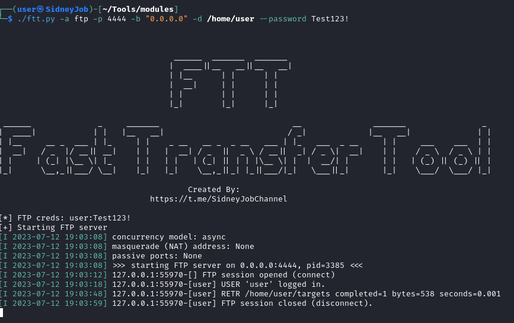
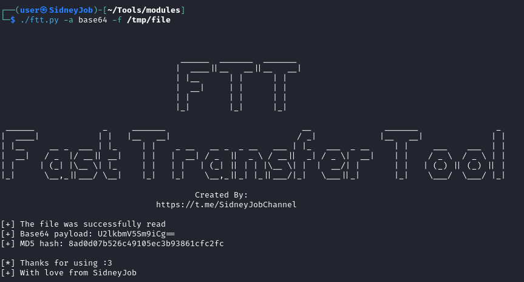
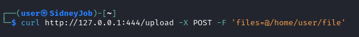
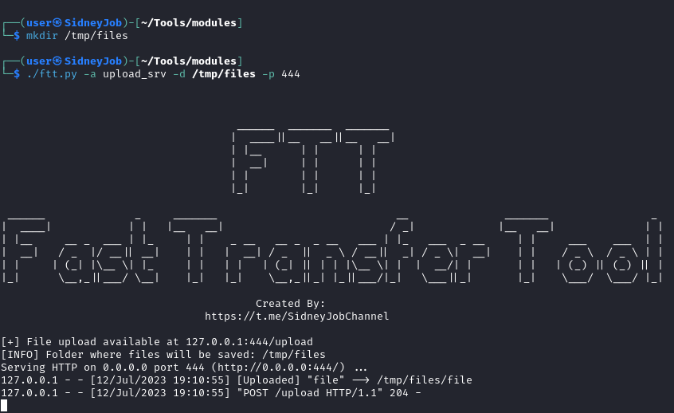
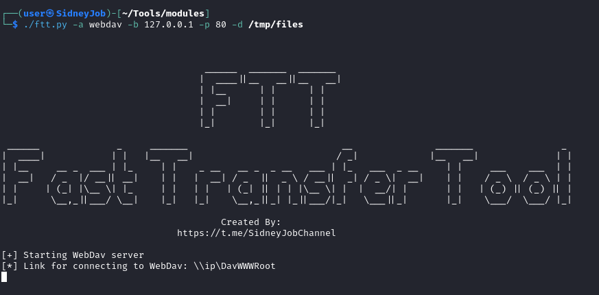
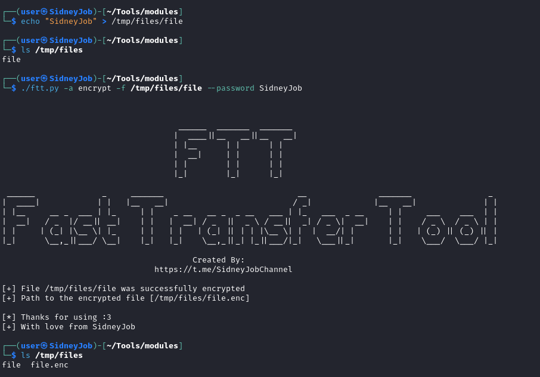
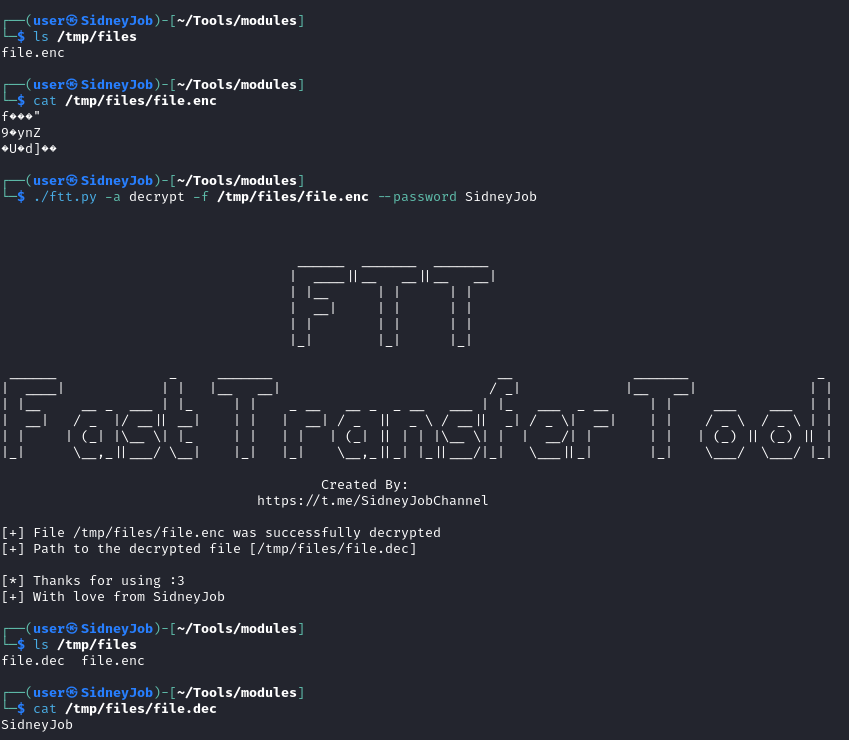
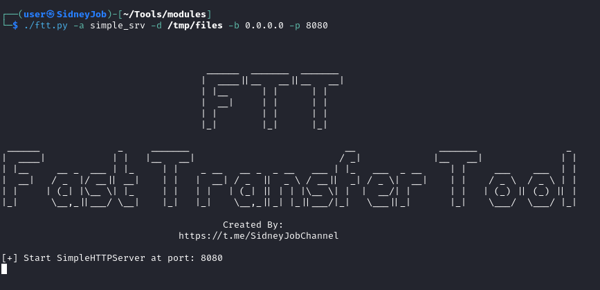

# FTT (Fast Transfer Tool)

## About

- Created by: SidneyJob
- Links: https://t.me/SidneyJobChannels
- Source Code: https://github.com/

## List of all available commands

| N   | Command    | Description                               |
| --- | ---------- | ----------------------------------------- |
| #1  | help       | Show help page                            |
| #2  | ftp        | Start FTP server                          |
| #3  | base64     | Base64 encode file and calculate md5 hash |
| #4  | upload_srv | Start server for uploading files          |
| #5  | webdav     | Start WebDav server                       |
| #6  | encrypt    | Encrypt file with AES algorithm           |
| #7  | decrypt    | Decrypt file with AES algorithm           |
| #8  | simple_srv | Start SimpleHTTPServer                    | 


## List of all available arguments

| Action            | Desctiption                                 |
| ----------------- | ------------------------------------------- |
| "a"               | Select action                               |
| "-b"              | Address which will bound                    |
| "-p"              | Port which will bound                       |
| "-d"              | Select starting directory                   |
| "-f"              | File to be read                             |
| "--password"      | Password, may be included for some services | 
| "--show-commands" | Show some available commands                |
| "--debug"         | Enable debug info                           |


## Explore functions

### ftp

| Argument | Description                                                                 | Default Value |
| -------- | --------------------------------------------------------------------------- | ------------- |
| dir      | Define starting dir                                                         | /tmp          |
| host     | Define address                                                              | 0.0.0.0       |
| port     | Define port                                                                 | 21            |
| password | Is this argument will be used, then will be created user with this password | Not defined   |

#### Example

```bash
./ftt.py -a ftp -p 4444 -b "0.0.0.0" -d /home/user
./ftt.py -a ftp -p 4444 -b "0.0.0.0" -d /home/user --password Test123!
```



### base64

| Argument | Description                   | Default Value |
| -------- | ----------------------------- | ------------- |
| file     | Define the file to be encoded | Not defined   |

#### Example
```bash
./ftt.py -a base64 -f /tmp/file
```



### upload_srv

| Argument | Description                                                                 | Default Value |
| -------- | --------------------------------------------------------------------------- | ------------- |
| dir      | Define starting dir                                                         | /tmp          |
| port     | Define port                                                                 | 8000          |

You can read more here: [Link](https://pypi.org/project/uploadserver/)

#### Example
```bash
./ftt.py -a upload_srv -d /tmp/files -p 44
```




### webdav

| Argument | Description         | Default Value |
| -------- | ------------------- | ------------- |
| dir      | Define starting dir | /tmp          |
| host     | Define address      | 0.0.0.0       |
| port     | Define port         | 80            |

#### Example
```bash
./ftt.py -a webdav -b 127.0.0.1 -p 80 -d /tmp/files
```



### encrypt/decrypt

| Argument | Description                                                        | Default Value |
| -------- | ------------------------------------------------------------------ | ------------- |
| file     | Define file for encryption/decryption                              | Not defined   |
| password | Define the password that will be used to encrypt/decrypt this file | Not defined   |

#### Example
```bash
./ftt.py -a encrypt -f /tmp/files/file --password SidneyJob
./ftt.py -a decrypt -f /tmp/files/file.enc --password SidneyJob
```




### simple_srv

| Argument | Description         | Default Value |
| -------- | ------------------- | ------------- |
| dir      | Define starting dir | /tmp          |
| host     | Define address      | 0.0.0.0       |
| port     | Define port         | 80            |

#### Example
```bash
./ftt.py -a simple_srv -d /tmp/files -b 0.0.0.0 -p 8080
```



